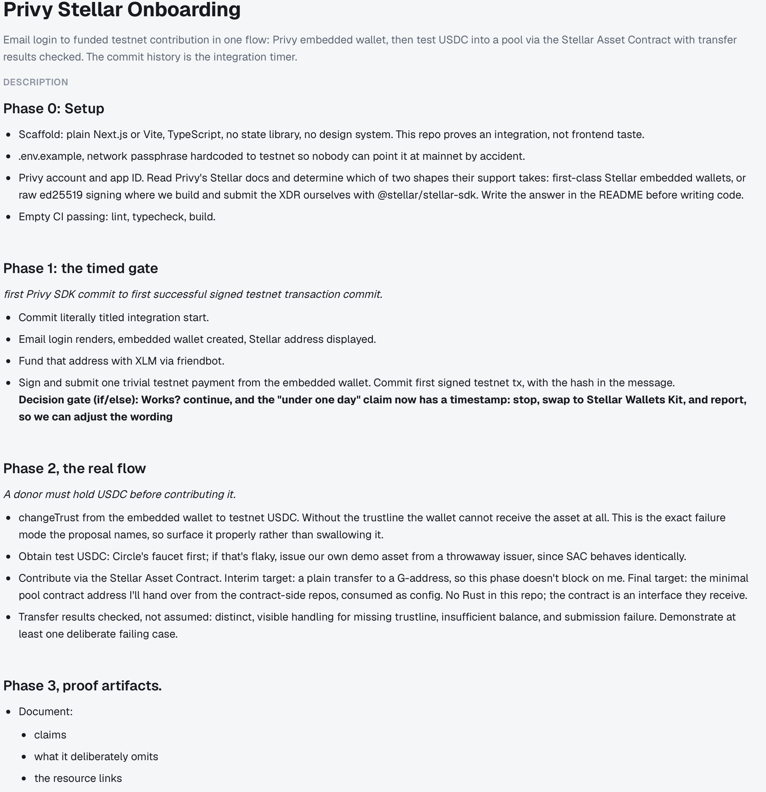
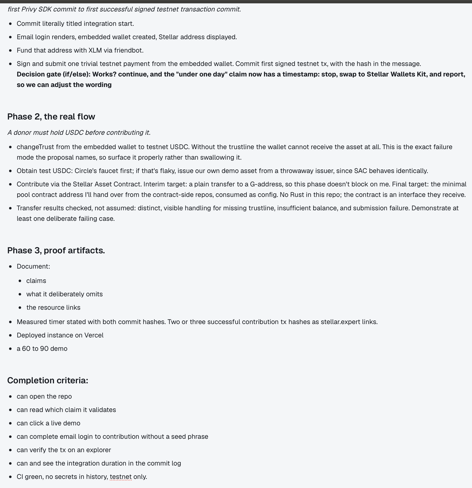

# Original brief

Kept verbatim for reference. This is the source task description; the README is
the maintained document. (To be moved to Clarus and reformatted as in the
screenshots below.)

---

**Phase 0: Setup**

Scaffold: plain Next.js or Vite, TypeScript, no state library, no design system. This repo proves an integration, not frontend taste.

`.env.example`, network passphrase hardcoded to testnet so nobody can point it at mainnet by accident.

Privy account and app ID. Read Privy's Stellar docs and determine which of two shapes their support takes: first-class Stellar embedded wallets, or raw ed25519 signing where we build and submit the XDR ourselves with `@stellar/stellar-sdk`. Write the answer in the README before writing code.

Empty CI passing: lint, typecheck, build.

**Phase 1: the timed gate**

First Privy SDK commit to first successful signed testnet transaction commit.

Commit literally titled `integration start`.

Email login renders, embedded wallet created, Stellar address displayed.

Fund that address with XLM via friendbot.

Sign and submit one trivial testnet payment from the embedded wallet. Commit `first signed testnet tx`, with the hash in the message.

Decision gate (if/else): Works? continue, and the "under one day" claim now has a timestamp. Else: stop, swap to Stellar Wallets Kit, and report, so we can adjust the wording.

**Phase 2: the real flow**

A donor must hold USDC before contributing it.

`changeTrust` from the embedded wallet to testnet USDC. Without the trustline the wallet cannot receive the asset at all. This is the exact failure mode the proposal names, so surface it properly rather than swallowing it.

Obtain test USDC: Circle's faucet first; if that's flaky, issue our own demo asset from a throwaway issuer, since SAC behaves identically.

Contribute via the Stellar Asset Contract. Interim target: a plain transfer to a G-address, so this phase doesn't block on me. Final target: the minimal pool contract address I'll hand over from the contract-side repos, consumed as config. No Rust in this repo; the contract is an interface they receive.

Transfer results checked, not assumed: distinct, visible handling for missing trustline, insufficient balance, and submission failure. Demonstrate at least one deliberate failing case.

**Phase 3: proof artifacts**

Document: claims, what it deliberately omits, the resource links.

Measured timer stated with both commit hashes. Two or three successful contribution tx hashes as stellar.expert links.

Deployed instance on Vercel. A 60 to 90 second demo.

Completion criteria: can open the repo; can read which claim it validates; can click a live demo; can complete email login to contribution without a seed phrase; can verify the tx on an explorer; can see the integration duration in the commit log. CI green, no secrets in history, testnet only.

---

